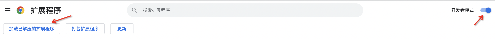
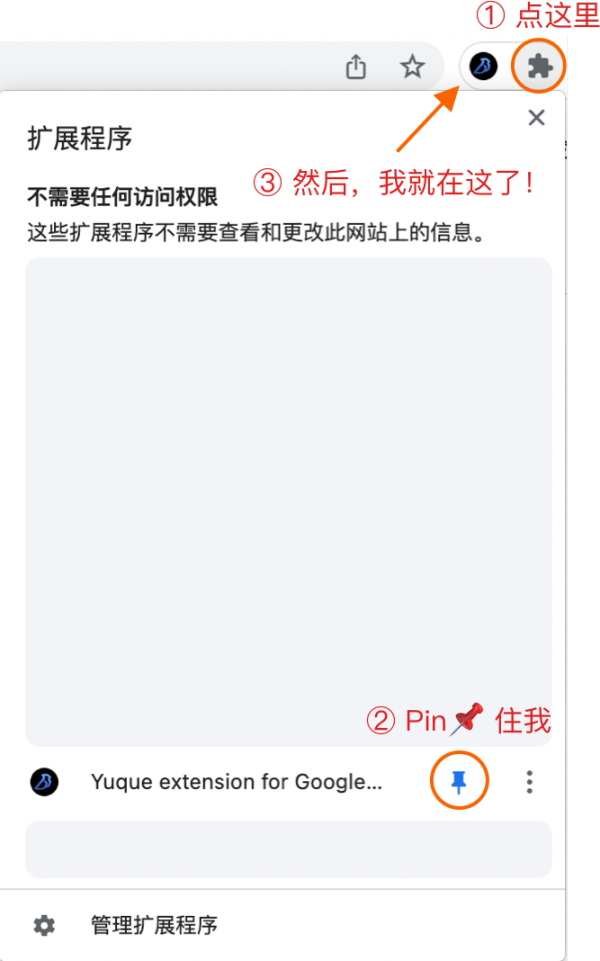

<!--
 * @Author: Cishenn Lee
 * @Date: 2025-04-28 13:37:07
 * @LastEditTime: 2025-04-28 13:44:39
 * @FilePath: \RExtractor\README.md
 * @Description: 
-->
# Sadp抽取器浏览器插件RExtractor


## 如何开发

```bash
# 安装 npm 依赖
$ npm install

# 启动开发环境
$ npm run dev
```






